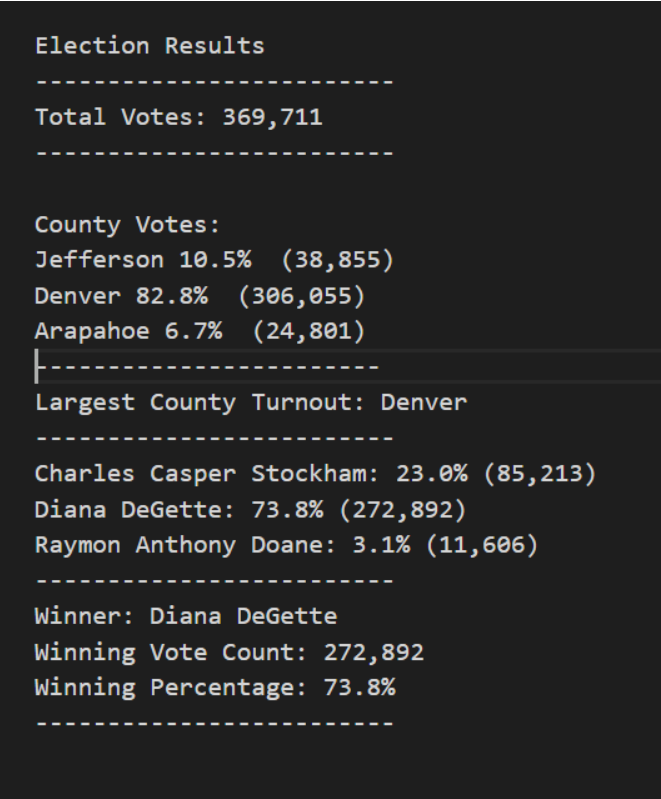

# Election Analysis
## Project Overview
A Colorado Board of Elections requested the following tasks to be completed from the election audit in the recent congressional election.

1. Calculate the total number of votes casted
2. List of candidates who received votes
3. Total number of votes each candidate received:
4. Total percentage of votes each candidate received:
5. The winner of the election based on popular vote:
 
 ## Resources
 - Data source: election_results.csv
 - Software: Python 3.7, Visual Code Studio 1.38.1
 
 ## Summary
 The analysis of the election show that:
 
 - There were 369,711 votes cast in the election
 
 The candidates were:
 - Charles Casper Stockham
 - Diana DeGette
 - Raymon Anthony Doane
 
The candidate results were:

Total number of votes for each candidate:
**Charles Casper Stockham: 85,213 votes
**Diana DeGette: 272,892 votes
**Raymon Anthony Doane: 11,606 votes

Total number of percentage of votes:
 **Charles Casper Stockham: 23.0% 
 **Diana DeGette: 73.8%
 **Raymon Anthony Doane: 3.1%

The winner of the election was:
- Winner: Diana DeGette
- Winning Vote Count: 272,892
- Winning Percentage: 73.8%

## Challenge overview
To find out the resent election results as requested by The Colorado Election Board.  These were the question to be answered:
- Total number of votes cast
- A complete list of candidates who received votes
- Total number of votes each candidate received
- Percentage of votes each candidate won
- The winner of the election based on popular vote 

Analysis performed: 
- Calculated the total election votes 
- Retrieved names of the candidates'
- Retrieved candidates' votes
- Retrieved candidates' percentage of votes
- Determined the winning candidate

## Challenge summary

This analysis was to find out the election results from the Colorado Elections Board.  We used Python (programming language for data science) in our analysis to be able to output the requested information.  We applied decision statements, membership and logical operators, repetition statements to write the algorithms. The pseudocode outlined each step in the programming process.  The step-by-step analysis was frequently committed to GitHub.   

 
 
 
